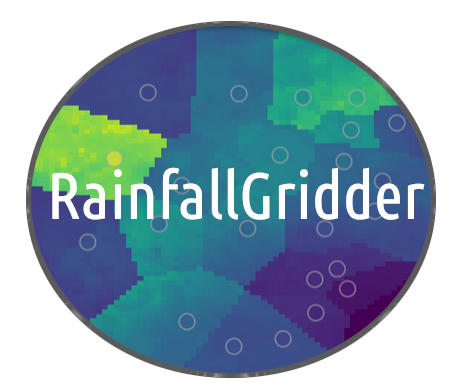

===============
RainfallGridder
===============
|madebyhumans| |opensource| |pypi| |openssf| |docs| |license| |uv| |ruff|

Python package for interpolating rainfall data onto a regular grid.

Documentation and License
=========================
* RainfallGridder is developed and maintained by UKCEH.
* Free software: GNU General Public License v3
* Documentation: https://nerc-ceh.github.io/RainfallGridder/

Features
========

* Will help you quality control and grid your 15 minute or hourly rain gauge data
* Provides a 4-step procedure for:
        1. Preparing your rain gauge data for gridding (combining duplicates by location)
        2. Quality controlling rain gauge data with `RainfallQC <https://codeberg.org/CEH-HOTDOG/RainfallQC>`_ and the `IntenseQC rulebase <https://www.sciencedirect.com/science/article/pii/S1364815221002127#tbl2>`_
        3. Correlating values daily sums of rain gauges to nearest daily gridded rainfall
        4. Generating grids using Nearest-neighbour interpolation
* Built for the CEH-GEAR 15 min rainfall product
* Free software: GPL v3 License

.. How to cite this package
.. ========================
.. To cite a specific version of RainfallQC, please see `Zenodo <https://zenodo.org/records/17457184>`_ DOI. 
.. For v0.3.1: https://doi.org/10.5281/zenodo.17457013

Credits
=======
* Please email tomkee@ceh.ac.uk if you have any questions.

RainfallGridder was created in 2026 by Tom Keel as part of the `Floods & Droughts Research Infrastructure (FDRI) <https://fdri.org.uk/>`_ project led by the `UK Centre for Ecology & Hydrology (UKCEH) <https://www.ceh.ac.uk/>`_

Built with `Cookiecutter <https://github.com/cookiecutter/cookiecutter>`_ and the `audreyfeldroy/cookiecutter-pypackage <https://github.com/audreyfeldroy/cookiecutter-pypackage>`_ project template.

.. |madebyhumans| image:: https://img.shields.io/badge/Humans-999999?style=flat&logo=Made by&label=Made By&labelColor=2BD962
        :alt: Made by humans

.. |opensource| image:: https://badges.frapsoft.com/os/v1/open-source.svg?v=103
        :alt: Open Source

.. |license| image:: https://img.shields.io/badge/License-GPLv3-blue.svg
        :alt: License

.. |uv| image:: https://img.shields.io/endpoint?url=https://raw.githubusercontent.com/astral-sh/uv/main/assets/badge/v0.json
        :alt: UV

.. |ruff| image:: https://img.shields.io/endpoint?url=https://raw.githubusercontent.com/astral-sh/ruff/main/assets/badge/v2.json
        :alt: Ruff Version

.. .. |pre-commit| image:: https://results.pre-commit.ci/badge/github/Thomasjkeel/jsmetrics/main.svg
..    :target: https://results.pre-commit.ci/latest/github/Thomasjkeel/jsmetrics/main
..    :alt: pre-commit.ci status

.. .. |codefactor| image:: https://www.codefactor.io/repository/github/thomasjkeel/jsmetrics/badge
..    :target: https://www.codefactor.io/repository/github/thomasjkeel/jsmetrics
..    :alt: CodeFactor

.. .. |coveralls| image:: https://coveralls.io/repos/github/Thomasjkeel/jsmetrics/badge.svg?branch=main
..    :target: https://coveralls.io/github/Thomasjkeel/jsmetrics?branch=main

.. .. |zenodo| image:: https://zenodo.org/badge/DOI/10.5281/zenodo.10822662.svg
..         :target: https://doi.org/10.5281/zenodo.10822662
..         :alt: Zenodo

.. .. |docs| image:: https://readthedocs.org/projects/jsmetrics/badge/?version=latest
..        :target: https://jsmetrics.readthedocs.io/en/latest/?badge=latest
..        :alt: Documentation Status

.. |pypi| image:: https://img.shields.io/pypi/v/rainfall-gridder.svg
        :target: https://pypi.org/project/rainfall-gridder/
        :alt: Python Package Index Build

.. .. |openssf| image:: https://api.scorecard.dev/projects/github.com/Thomasjkeel/jsmetrics/badge
..             :target: https://scorecard.dev/viewer/?uri=github.com/Thomasjkeel/jsmetrics
..             :alt: OpenSSF scorecard